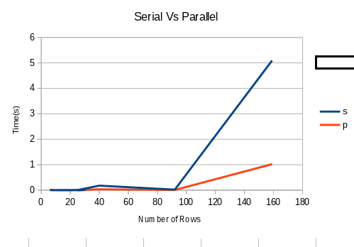

# Covering Arrays

This program will verify if its input is a covering array and identify "don't
care" positions if it is indeed a covering array.

# Input

The input is always rad from `stdin` and is expected to be in the following
format:

```
N t k v
1 0 ... k
.
.
.
N       Nk

where:

N - number of rows
t - number of columns per t-set
k - number of columns
v - number of symbols
```

# Output

A decision "true" or "false" on whether the input array is a covering array.  If
the array is a covering array, then print a map of the "don't care" positions as
a table then as (r,c) pairs.

# Design and Analysis (Serial)

### 1. Discuss selection of data structures for generating subarrays and t-sets.

All of the combinations of subarrays were held in a large vector of t element
arrays. Something like:

```
[0,1,2]
.......
.......
[2,3,4]
```

Where the rows contain indexes to the columns of the covering array. The were
calculated before checking the covering array.

Moreover, permutations of symbols were also calculated, but only when needed.

### 2. Discuss the data structure used to keep track of coverage conditions in the CA.

The main data structure in this project is:

```
// struct to represent Covering Array
typedef struct {
  int N; // number of rows
  int t; // number of columns per t-set
  int k; // number of columns
  int v; // number of symbols
  int **data; // 2d array for data
  int **dc; // used for storing don't care info
} CA;
```

It holds all the information from the input file. The 2d-array `data` field is
dynamically allocated because its not know until run time, all the other fields
are fixed in size.

### 3. Discuss the data structure used to keep track of "don't care" positions.

Along with the covering array, the CA structure also contains a `dc` field to
represent all the don't care positions. As we traverse the `data` 2d-array  with
respect to combinations of columns and permutations of symbols, I keep
track/count the number of occurrences in the `dc` 2d-array. If any elements are
0, then the input in not a covering array, if any of the positions are 1, they
can't be don't cares.

# Design and Analysis (Parallel)

### A. What speed-up, if any, is obtained by your parallel program over your serial program?

There was a dramatic speed up in the parallel program for test case 9. The
total run time went from about 5 seconds for the serial program to about 1
second for the parallel program. That is a 5x speed up! I did use 12
thread on 12 CPUs, so isn't amazing but its definitely a speed up.

### B. What size does the array need to be (for a given strength) before a speed-up is observed?

It took about and `N=30` and `k=100` (test case 5) before I began to see
differences in the run time of the parallel and the serial program. The
speed up was about 2x. Moreover, as both `N` and `k` keep growing the
parallel program begins to gain even more.

### 1. Discuss where you introduced threads, and how you did load balancing among threads.

Given my approach to the serial program, the parallel version was very
easy to write. I introduced the `#pragma omp parallel for` openmp
directive to the main for loop of the program. That is really all I had to
do to convert my program from a serial program, to a parallel program.

### 2. Describe any errors that arose (e.g., race conditions) and how you solved them.

After introducing concurrency into my program,  I discovered a point of
contention among the thread that caused data races. Threads could clobber
each other when updating the 2d array that keeps track of the don't care
positions. All the other pieces of data are just reads, so even though
they area shared, the lack of updates prevents cause race conditions. To
address this issue I wrapped the update in a `#pragma omp critical` openmp
directive. After applying this fix, the parallel program output matched
the serial program output.

### 3. Describe the activities you performed to improve the speed-up of your parallel program.

To try and improve performance, I add another `#pragma omp parallel for`
openmp directive to the inner loop in the main function. The issue with
this approach is that spawning threads is expensive, and then waiting for
them to all join back up leaves a lot of threads idle. So introduced more
threads to the program actually gave me negative results, so I decided
against it.

## Results

Below are the numerical results from my final analysis of both the serial
and the parallel program run on the ASURE cluster.



| #  | N    | t   | k     | v   | serial  | parallel |
|----|------|-----|-------|-----|---------|----------|
| 01 | 6    | 2   | 5     | 2   | 0.001   | 0.011
| 02 | 10   | 2   | 20    | 2   | 0.001   | 0.002
| 03 | 11   | 2   | 50    | 2   | 0.002   | 0.002
| 04 | 21   | 2   | 25    | 3   | 0.002   | 0.002
| 05 | 30   | 2   | 100   | 3   | 0.011   | 0.005
| 06 | 25   | 3   | 20    | 2   | 0.004   | 0.003
| 07 | 40   | 3   | 75    | 2   | 0.178   | 0.035
| 08 | 92   | 3   | 20    | 3   | 0.022   | 0.007
| 09 | 159  | 3   | 100   | 3   | 5.092   | 1.021
| 10 | 35   | 2   | 250   | 3   | 0.066   | 0.022
| 11 | 6    | 2   | 5     | 2   | 0.001   | 0.002
| 12 | 10   | 2   | 20    | 2   | 0.001   | 0.002
| 13 | 11   | 2   | 50    | 2   | 0.001   | 0.002
| 14 | 21   | 2   | 25    | 3   | 0.001   | 0.002
| 15 | 30   | 2   | 100   | 3   | 0.002   | 0.003    |

# Test

To run all of the tests in the test directory locally, do:

    $ make test

The project contains an output.txt as a sample of the output the test command
produces.

To run the tests on the ASURE cluster, do:

    $ sbatch -N1 -n12 --mem-per-cpu=100m -t00:05:00 --qos=test test.sh

The project contains a slurm-[id].out file of the batch command being run
on the ASURE cluster.
